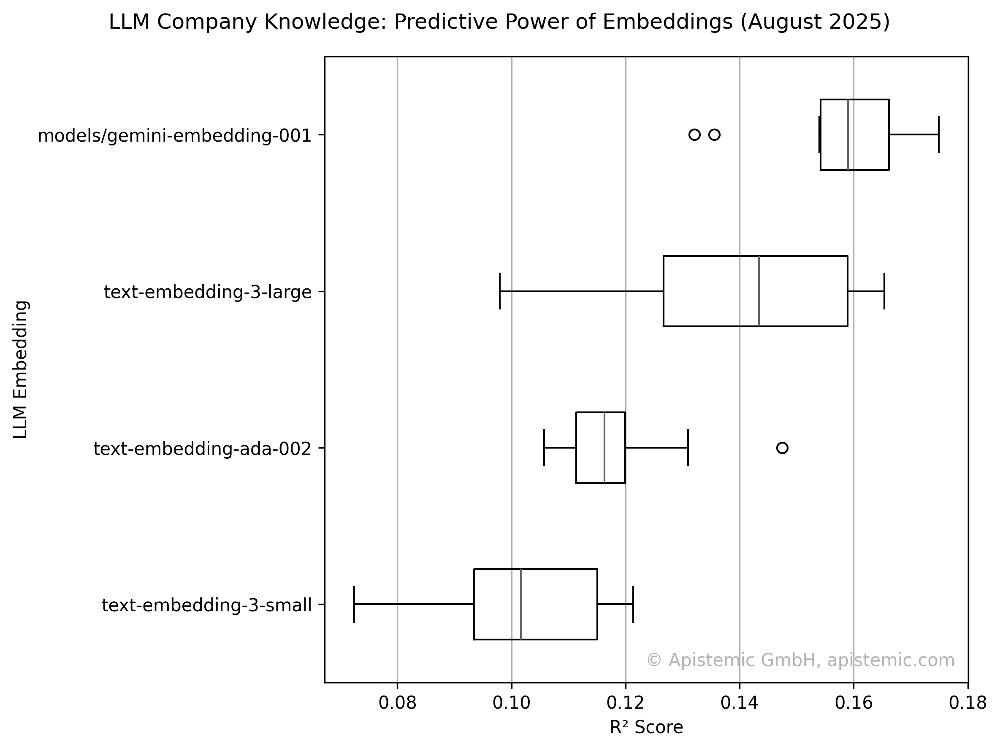

# Apistemic Benchmarks

Since we do a lot of LLM-based company analysis at [apistemic](https://apistemic.com),
we decided to have one central place to keep track of all the benchmarks we do.
This repo thus covers many business/company-related LLM benchmarks.

## Implicit Company Knowledge in Embeddings
**Goal**: 
With this benchmark, we want to explore how well LLMs understand companies (and markets).

**Methodology**:
To measure inherent company knowlege, we prompt the name of companies to get an embedding.
These embeddings are then used as the only input for a complex regression task, 
i.e. scoring the competitiveness of two companies.
A task, that requires a wide and deep understanding of markets, individual companies, business models, and more.

**Dataset**:
The dataset for this benchmark is provided by [apistemic markets](https://markets.apistemic.com).
The data contains expert evaluations of competitive positioning between company pairs, 
where industry professionals assessed relative competitiveness using a standardized five-point scale. 
These assessments span diverse sectors, encompassing companies of varying sizes and geographic locations 
to ensure comprehensive coverage across different market contexts.

**Results**:

## LLM-based Company Competitiveness Scoring
**Goal**: 
Evaluate how well different LLMs can directly assess company competitiveness compared to human raters.

**Methodology**:
We prompt LLMs to rate the competitiveness between company pairs on a 1-5 scale.
We previously prompted human raters to do the same with the same prompts.

The LLMs receive only company names and must use their internal knowledge to assess competitive relationships. 
Performance is measured using R² scores and Spearman correlations against expert human evaluations.
While R² should rate overall similarity to human raters, Spearman correlations between human and LLM ratings should indicate directional correctness,
i.e. whether the LLM has a sense of competitiveness more generally.

**Dataset**:
Same expert-evaluated competitive positioning dataset from [apistemic markets](https://markets.apistemic.com).

**Results**:

