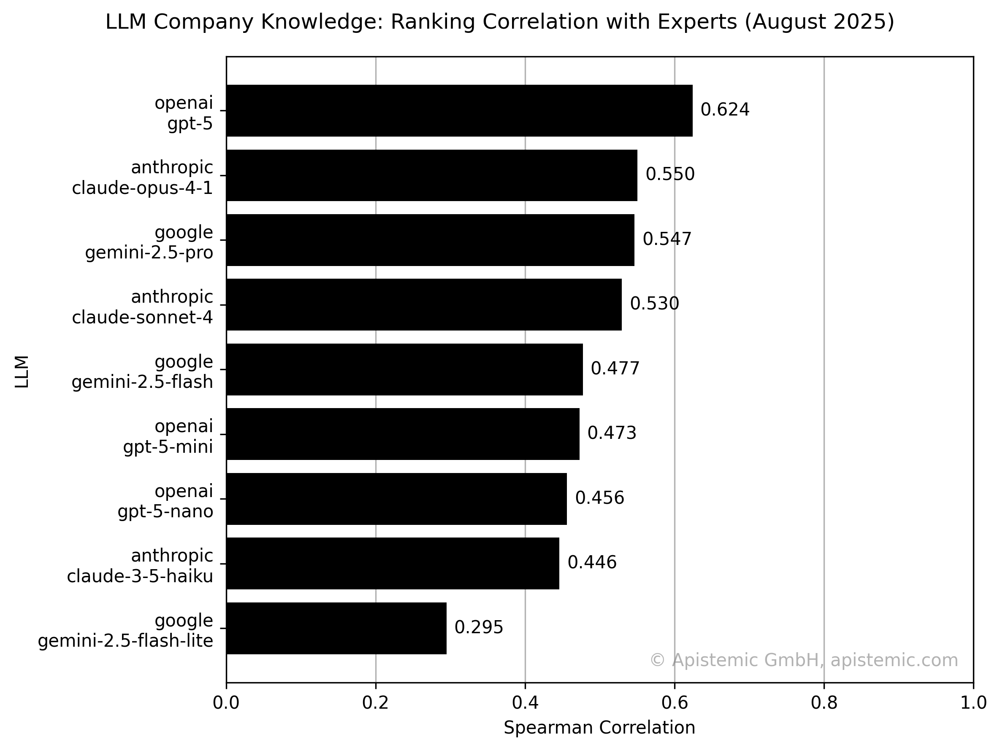

# Company-data focused LLM Benchmarks
We've spent thousands of dollars evaluating LLM performance with company data - so you can skip straight to the results.
Watch this repo to get a notification as soon as there's a new benchmark or model.

Since we do a lot of LLM-based company analysis at [apistemic](https://apistemic.com),
we decided to have one central place to keep track of all the benchmarks.
This repo thus covers many business/company-related LLM benchmarks.

## How well do LLMs understand companies?
Firstly, we want to evaluate how much inherent knowledge LLMs have about companies and markets.
To do this, we just use company names in all benchmarks without any further context provided.

### Benchmark: Measuring company knowledge inherent in embeddings {#embeddings-benchmark}
To measure the LLMs' company knowledge in both width and depth,
we embed company names in this benchmark.
With the assumption being that the more inherent knowledge an LLM has about companies,
the more information its embeddings contain.

**Methodology**:
To measure inherent company knowlege, we prompt the name of companies to get an embedding.
These embeddings are then used as the only inputs for a complex regression task, 
namely scoring the competitiveness of two companies via an SVM.
A task, that requires a wide and deep understanding of markets, individual companies, business models, and more.

**Dataset**:
See [Competitive Positioning Dataset from Apistemic Markets](#competitive-positioning-dataset).

**Results**:

### Benchmark: Measuring inherent company knowledge by rating competitiveness {#rating-benchmark}
As a second benchmark to measure company knowledge, 
we use the same task as before and prompt the LLMs directly this time.
We thus provide each LLM with the same instructions a human rater got 
and ask it to rate the competititveness of two companies.
Our assumption is that the more knowledge (and understanding) an LLM has, both in width and depth,
the better it can perform a competitiveness evaluation.

**Methodology**:
This benchmark prompts LLMs to rate the competitiveness of company pairs on a 1-5 scale.
We previously prompted human raters to do the same with the same prompts.
The LLMs receive only company names and must use their internal knowledge to assess competitive relationships. 
Performance is then measured using R² scores and Spearman correlations against expert human evaluations.
While R² should rate overall similarity to human raters, 
Spearman correlations between human and LLM ratings should indicate directional correctness,
i.e. whether the LLM has a sense of competitiveness more generally.

**Dataset**:
See [Competitive Positioning Dataset from Apistemic Markets](#competitive-positioning-dataset).

**Results**:

## Datasets

Our benchmarks are based on proprietary datasets.
This sections covers a description of each dataset used.

### Competitive Positioning Dataset from Apistemic Markets {#competitive-positioning-dataset}

**Source**: [apistemic markets](https://markets.apistemic.com)

**Description**: 
Expert evaluations of competitive positioning between company pairs, 
where industry professionals assessed relative competitiveness using a standardized five-point scale. 
These assessments span diverse sectors, encompassing companies of varying sizes and geographic locations 
to ensure comprehensive coverage across different market contexts.

**Used in**:
- [Benchmark: Measuring company knowledge inherent in embeddings](#embeddings-benchmark)
- [Benchmark: Measuring inherent company knowledge by rating competitiveness](#rating-benchmark)
